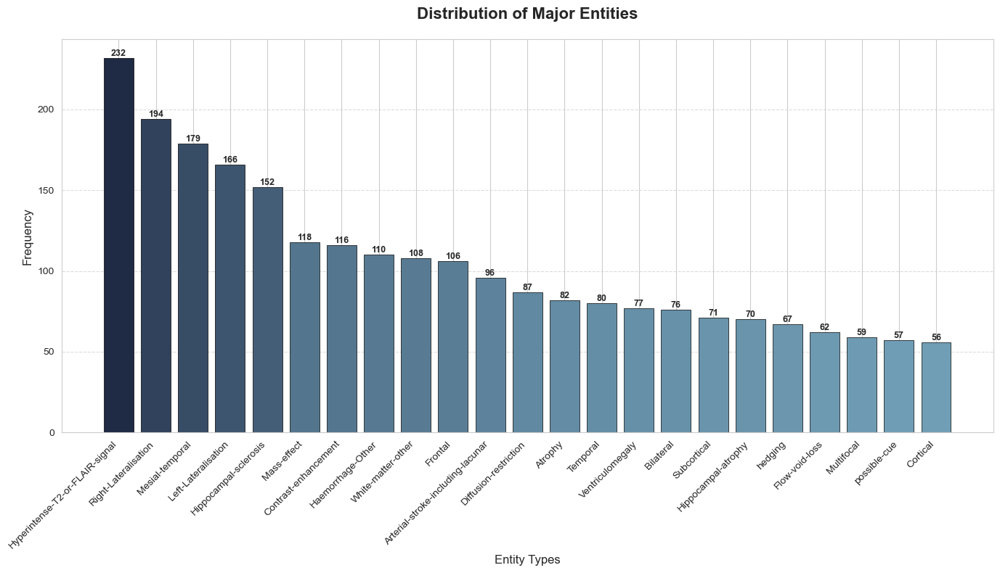

# Knowledge-Tree-Driven Contextualized Instruction Tuning for Epilepsy Drug Recommendation

This project introduces TREE-TUNE, a novel framework that leverages biomedical vision–language foundation models along with an expert-designed MRI knowledge tree to enhance epilepsy drug recommendation. Our approach is insrtuction tuning models using contextualized instruction–answer pairs derived from both knowledge tree, MRI scans and reports, aiming to improve the prediction of antiseizure medication outcomes, even for drugs not encountered during training.

## Project Overview

Epilepsy affects millions worldwide, yet selecting the optimal antiseizure medication (ASM) remains a challenge due to the current trial-and-error approach. TREE-TUNE addresses this by:
- **Incorporating Expert Knowledge:** Utilizing a hierarchical MRI knowledge tree that categorizes anatomical and pathological entities. This tree guides the generation of nuanced, context-aware instruction–answer pairs.
- **Leveraging Multimodal Data:** Combining visual features from MRI scans with textual information from reports to capture detailed clinical insights.
- **Generalizing Beyond Training Data:** Enabling outcome predictions for both common ASMs and unseen drugs by encoding medications with molecular representations.

## MRI Entity Distribution

An integral part of TREE-TUNE is the detailed analysis of MRI entity distribution. The project provides visual insights into how MRI entities are organized and annotated:
  

For a complete view of the entity taxonomy, refer to: [Knowledge_MRI_Tree](MRI_entities/Knowledge_MRI_Tree.conf)

## Impact

By integrating domain-specific knowledge and state-of-the-art biomedical models, TREE-TUNE significantly improves the accuracy of ASM outcome predictions. This represents a crucial step toward a reasoning-driven, personalized approach to epilepsy treatment, potentially reducing the time and uncertainty associated with finding effective medication.

## Citation

If you use or extend this work, please cite the corresponding publication in MICCAI 2025.
